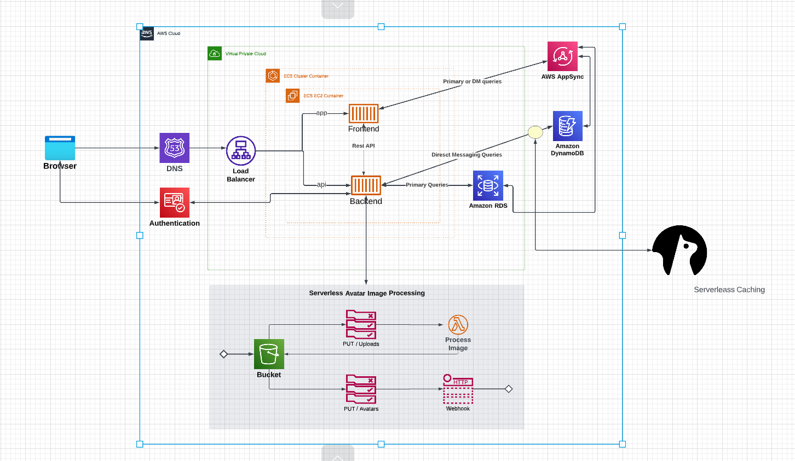
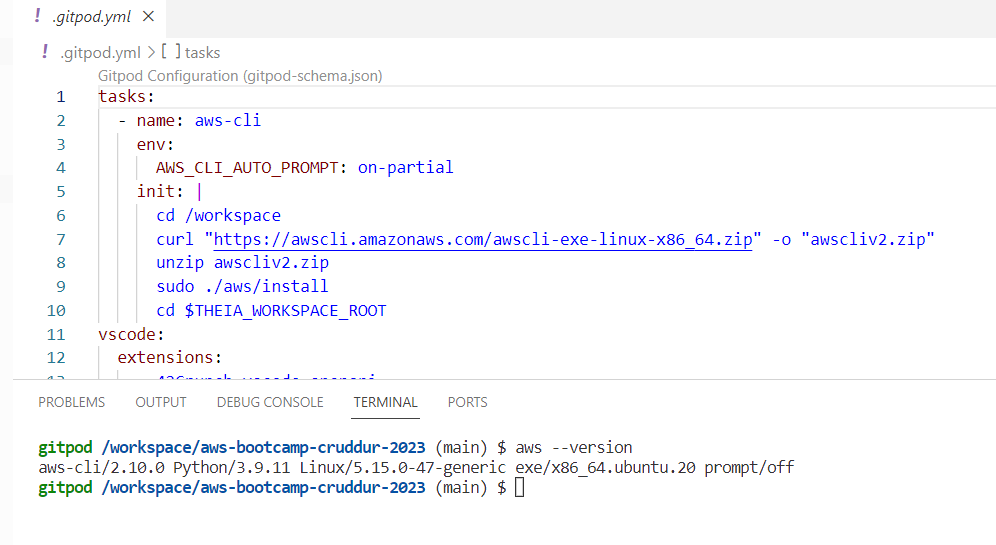
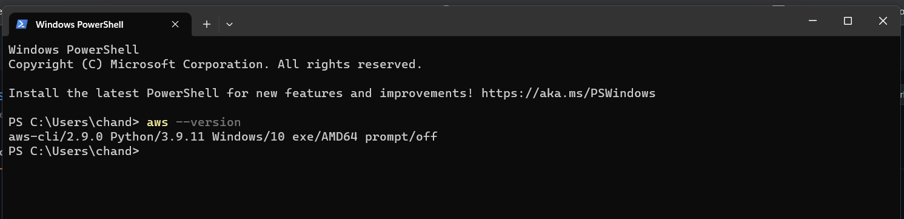
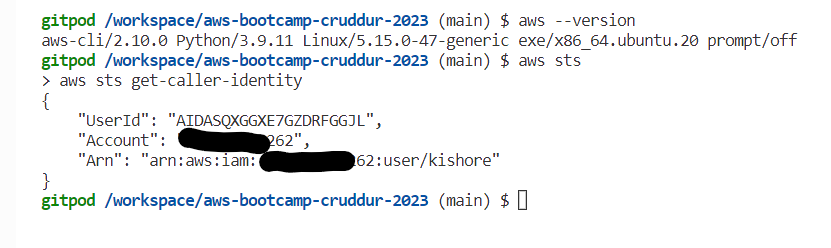
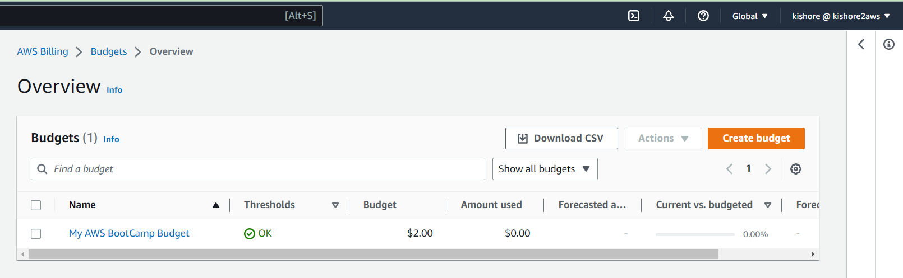
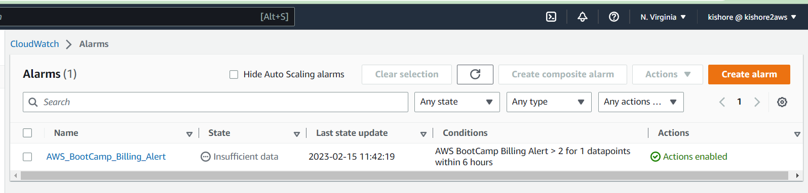

# Week 0 — Billing and Architecture

## Architecture Diagram

The image below is the architecture of the micro blogging app



- To view the chart please check the following link
(https://lucid.app/lucidchart/34d0fe0e-7bda-4fe2-a832-8982f857f6b4/edit?viewport_loc=-1141%2C-105%2C3405%2C1584%2C0_0&invitationId=inv_d5b19804-a73b-4180-8436-1096872e7dc9)

---

The first week of Andrew Brown’s AWS Cloud Project Bootcamp was a thrilling experience, filled with valuable lessons and hands-on learning. During this week, we went over Billing and Architecture and created a diagram of the Crudder app that we are going to create.

# Gather Requirements

We started by learning about the importance of gathering requirements before starting any project. This involves understanding the user’s needs, business objectives, and the constraints of the project. It helps in creating a solid foundation for the project and ensures that the end product meets the user’s expectations.

# Conceptual Design (Napkin)

Next, we learned about the conceptual design phase, where we use simple sketches or diagrams to visualize the high-level structure of the project. This phase is also referred to as the “napkin phase” as the designs are usually created on a napkin or a piece of paper.

# Logical Design (Blue Print)

We then learned about the logical design phase, where we create a more detailed blueprint of the project. This includes adding more detail to the conceptual design and determining the necessary components and their relationships.

# Physical Design (Resource names)

The physical design phase involves determining the resource names and the relationships between the resources. This phase helps in creating a clear and concise picture of the architecture and helps in identifying any potential issues.

# Ask Dumb Questions (Risks, Assumptions, Constraints)

During the bootcamp, we also learned about the importance of asking dumb questions. This involves asking questions about the risks, assumptions, and constraints of the project to ensure that nothing is overlooked.

# Document Everything

Documentation is a critical aspect of any project, and we learned about the importance of documenting everything. This includes documenting the requirements, design, and implementation details.

# TOGAF standard for architecture

We also learned about the TOGAF standard for architecture, which is a framework for enterprise architecture that provides a common language and methodology for designing and managing enterprise architecture.

# AWS Well-Architected Framework

Finally, we learned about the AWS Well-Architected Framework, which is a set of best practices for reviewing workloads against current best practices in the cloud.

---

This week the team will be discussing the billing architecture security.

- The pricing of aws services is vary depending on the region. 
- Make sure to use the region close to you and see if all services you will utilise are available for the region. 
- And also make sure you set the billing alarm and bugets so you don't have unexpected costs. 
- Create an IAM user, make sure to attach a billing policy otherwise you won't be able to access this part of the console and you will get an error as you don't have permission.


## Information about Billing Alerts, Tags, Cost Explorer

In this section, we will be discussing the billing dashboard and all its components such as Cost Explorer, Billing Alerts, Tags, AWS calculator etc.

# Billing Alerts

There are 2 ways to set the billing alerts.

- Using Budget. You can create only 2 budgets on Free Tier Account
- Using Cloudwatch Alarm. You can create up to 10 free cloudwatch alarm on Free Tier Account

# Free Tier

- This section will show all the usage of your free tier. 
- It will show all the services free for the 12 months (starting with the registration) and their usage and forecast. 
- After 12 months, they are still some services that are always free. 
- And also there is some service that is "Trial" which means that is available for a short period such as 30 days

# Tags

- Tags (are Key/Value pair) are useful when you want to know how your cost is allocated. 
- For example, if your want to identify all the services you used under the tag environment: dev (for example)

# Cost Explorer

- Cost explorer is a service which visualises, understands and manages your AWS costs usage over time.

# Credit

- This is the section where you submit the credit that you have to obtain during an event (for example after submitting a feedback questionnaire). 
- And also it shows when the expiration date.

# AWS Calculator

- This is a tool where you want to estimate the cost of one or more services. 
- Useful when someone asks you to give an estimated cost of the service you are going to use. 

---

## Security

The important thing when it comes to security. Always inform the business of the technical risk that can exist of open vulnerabilities that have not been resolved and can potentially affect the business and how will be solved.

# Definition of the cloud security

Cybersecurity protects data, applications and services associated with cloud environments from both external and internal security threats.

# Why care about cloud security

- Reducing the impact of the breach
- Protecting all the system (application, network etc) against malicious data theft
- Reducing the human error responsible for data leaks

# Cloud Security requires practice

- Understand the complexity of the system
- Always keep updated with the new services announced
- Bad hackers are improving as well.

# MFA for root account

Root user is the most powerful user in aws environment. I consider it the key to your kingdom. Once it is compromised, hackers can spin any services on your AWS account. Enable the MFA for the root account gives you an extra layer of security. Could be virtual or physical.

# AWS Organization

Create an organization unit. AWS Organization allows you to create and manage multiple account. Also it allows to apply governance policies to accounts or group. 
There are 2 approce to create the organization:

- Creating business unit (HR, Finance, Engineering)
- Creating a Standby and Active Pool.


# AWS Cloud Trail

Auditing Service in AWS. Most all the api will be recorded in this service. Cloudtrail will record only the activity in the region you will operate. This service is not free


# IAM

Ability to access using user and password 3 kinds of users:

- IAM user with user and password (make sure MFA is active as well as you activated on root account)
- Federated user are users federated from an on-premise environment without a password
- Web Token User
 
Always Give the least privilege to the users using IAM Policies. Don't give more than what it is necessary.

When you are working on AWS, it is a best practice to use the IAM user instead of the Root account. 
If for some reason the IAM user is compromised, it is simple to solve the problem by removing the policy attached to it or deleting the user himself.

Policies are assigned to either an IAM user or IAM role or IAM group and consist of what the entity can/can't do. 
For example, a policy could be the possibility to read the content of the s3 bucket.

# Access Key and Secret Access Key

- Access Key and Secret Access key are similar to the user and password (keep it always secret). 
- One reason you need to use it is for example you need to do some calls using CLI. 
- Never hardcode this information on services that it is public expose (for example code on github with access key and secret access key) as bad actors could reuse those access to do bad actions (exploit your application and get sensible information or spin services)
- In some cases you need to use an IAM Role and attach it to a service or even a user. 
- The difference between Iam user and Iam role is once the entity assumes the IAM role, it is valid for a short time and temporarily loses the previous privilege.

---

## Getting the AWS CLI working

We'll be using the AWS CLI often in this bootcamp, so we'll proceed to installing this account.

## Install AWS CLI

-  We are going to install the AWS CLI when our Gitpod enviroment lanuches.
-  We are are going to set AWS CLI to use partial autoprompt mode to make it easier to debug CLI commands.
- The bash commands we are using are the same as the [AWS CLI Install Instructions]https://docs.aws.amazon.com/cli/latest/userguide/getting-started-install.html

Update our `.gitpod.yml` to include the following task.

```sh
tasks:
  - name: aws-cli
    env:
      AWS_CLI_AUTO_PROMPT: on-partial
    init: |
      cd /workspace
      curl "https://awscli.amazonaws.com/awscli-exe-linux-x86_64.zip" -o "awscliv2.zip"
      unzip awscliv2.zip
      sudo ./aws/install
      cd $THEIA_WORKSPACE_ROOT
```






We'll also run these commands indivually to perform the install manually

### Create a new User and Generate AWS Credentials

- Go to [IAM Users Console] create a new user
- `Enable Billing console access` for the user
- Create a new `Admin` Group and apply `AdministratorAccess` and add the newly created user into this group.
- Create the user and go find and click into the user
- Click on `Security Credentials` and `Create Access Key`
- Choose AWS CLI Access
- Download the CSV with the credentials


### Set Env Vars

We will set these credentials for the current bash terminal
```
export AWS_ACCESS_KEY_ID=""
export AWS_SECRET_ACCESS_KEY=""
export AWS_DEFAULT_REGION=ap-south-1
```

We'll tell Gitpod to remember these credentials if we relaunch our workspaces
```
gp env AWS_ACCESS_KEY_ID=""
gp env AWS_SECRET_ACCESS_KEY=""
gp env AWS_DEFAULT_REGION=ap-south-1
```

### Check that the AWS CLI is working and you are the expected user

```sh
aws sts get-caller-identity
```

You should see something like this:
```json
{
    "UserId": "xxxxxxxxxxxxxxxxxxxxxxxxx",
    "Account": "xxxxxxxxxxxxxxx",
    "Arn": "arn:aws:iam::xxxxxxxxxxxx:user/aws-account-name"
}
```



## Create an AWS Budget

[aws budgets create-budget]
(https://docs.aws.amazon.com/cli/latest/reference/budgets/create-budget.html)
(https://docs.aws.amazon.com/cli/latest/reference/budgets/create-budget.html#examples)

Get your AWS Account ID
```sh
aws sts get-caller-identity --query Account --output text
```

- Supply your AWS Account ID
- Update the json files
- This is another case with AWS CLI its just much easier to json files due to lots of nested json

```sh
budget.json
-----------
{
    "BudgetLimit": {
        "Amount": "100",  
        "Unit": "USD"
    },
    "BudgetName": "Example Tag Budget",
    "BudgetType": "COST",
    "CostFilters": {
        "TagKeyValue": [
            "user:Key$value1",
            "user:Key$value2"
        ]
    },
    "CostTypes": {
        "IncludeCredit": true,
        "IncludeDiscount": true,
        "IncludeOtherSubscription": true,
        "IncludeRecurring": true,
        "IncludeRefund": true,
        "IncludeSubscription": true,
        "IncludeSupport": true,
        "IncludeTax": true,
        "IncludeUpfront": true,
        "UseBlended": false
    },
    "TimePeriod": {
        "Start": 1477958399,
        "End": 3706473600
    },
    "TimeUnit": "MONTHLY"
}

notifications-with-subscribers.json
-----------------------------------
[
    {
        "Notification": {
            "ComparisonOperator": "GREATER_THAN",
            "NotificationType": "ACTUAL",
            "Threshold": 80,
            "ThresholdType": "PERCENTAGE"
        },
        "Subscribers": [
            {
                "Address": "example@example.com",
                "SubscriptionType": "EMAIL"
            }
        ]
    }
]
```

```sh
aws budgets create-budget \
    --account-id AccountID \
    --budget file://aws/json/budget/budget.json \
    --notifications-with-subscribers file://aws/json/budget/budget-notifications-with-subscribers.json
```



You can create an environment variable of your `ACCOUNTID` and pass it to the command

```sh
export ACCOUNTID = aws sts get-caller-identity --query Account --output text

aws budgets create-budget \
    --account-id $AccountID \
    --budget file://aws/json/budget/budget.json \
    --notifications-with-subscribers file://aws/json/budget/budget-notifications-with-subscribers.json
```

## Creating a Billing Alarm

### Create SNS Topic
- We need an SNS topic before we create an alarm.
- The SNS topic is what will delivery us an alert when we get overbilled
- [aws sns create-topic](https://docs.aws.amazon.com/cli/latest/reference/sns/create-topic.html)

We'll create a SNS Topic
```sh
aws sns create-topic --name billing-alarm
```
which will return a TopicARN, Copy this `arn` and save it.

We'll create a subscription supply the `TopicARN` and our `Email`.
```sh
aws sns subscribe \
    --topic-arn TopicARN \
    --protocol email \
    --notification-endpoint your@email.com
```
Check your email and confirm the subscription.

#### Create Alarm

- [aws cloudwatch put-metric-alarm](https://docs.aws.amazon.com/cli/latest/reference/cloudwatch/put-metric-alarm.html)
- [Create an Alarm via AWS CLI](https://aws.amazon.com/premiumsupport/knowledge-center/cloudwatch-estimatedcharges-alarm/)
- We can create the alarm configuration json file from this URL. (https://aws.amazon.com/premiumsupport/knowledge-center/cloudwatch-estimatedcharges-alarm/)
- We need to update the configuration json script with the TopicARN we generated earlier 
- We are just a json file because --metrics is is required for expressions and so its easier to us a JSON file.

```sh
Create an alarm configuration as a JSON file
--------------------------------------------
{
    "AlarmName": "DailyEstimatedCharges",
    "AlarmDescription": "This alarm would be triggered if the daily estimated charges exceeds 50$",
    "ActionsEnabled": true,
    "AlarmActions": [
        "arn:aws:sns:<REGION>:<ACCOUNT_ID>:<SNS_TOPIC_NAME>"
    ],
    "EvaluationPeriods": 1,
    "DatapointsToAlarm": 1,
    "Threshold": 50,
    "ComparisonOperator": "GreaterThanOrEqualToThreshold",
    "TreatMissingData": "breaching",
    "Metrics": [{
        "Id": "m1",
        "MetricStat": {
            "Metric": {
                "Namespace": "AWS/Billing",
                "MetricName": "EstimatedCharges",
                "Dimensions": [{
                    "Name": "Currency",
                    "Value": "USD"
                }]
            },
            "Period": 86400,
            "Stat": "Maximum"
        },
        "ReturnData": false
    },
    {
        "Id": "e1",
        "Expression": "IF(RATE(m1)>0,RATE(m1)*86400,0)",
        "Label": "DailyEstimatedCharges",
        "ReturnData": true
    }]
}
```

```sh
aws cloudwatch put-metric-alarm --cli-input-json file://aws/json/alarm_config.json
```

